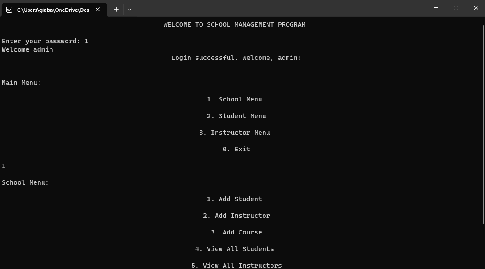

# School Management System Using C++

The School Management System is a console-based application developed in C++ that allows administrators, students, and instructors to manage information related to students, instructors, and courses within a school.

## Features

- **Admin Authentication:** The system begins with an admin authentication process to ensure secure access.

- **Main Menu:** Once authenticated, users can navigate through the main menu to access different functionalities:
  - **School Menu:** Add students, instructors, and courses. View all students, instructors, and courses.
  - **Student Menu:** Enroll in courses, view enrolled courses, drop courses, and view profiles.
  - **Instructor Menu:** Assign courses to teach, view assigned courses, remove course assignments, and view profiles.

A Screenshot from the Program

## Usage

1. **Compile the Code:** Compile the C++ code using a C++ compiler (e.g., g++).
   ```bash
   g++ main.cpp -o school_management
   ```

2. **Run the Executable:** Execute the compiled program.
   ```bash
   ./school_management
   ```

3. **Follow On-Screen Instructions:** Use the console interface to navigate through different menus and perform various actions.

## Contributing

Contributions are welcome! If you find any issues or have suggestions for improvements, please open an issue or create a pull request.

## License

This project is licensed under the [MIT License](LICENSE).

```

Feel free to customize it according to your specific project details and preferences. You can add more sections, such as "Installation," "Dependencies," or "Acknowledgments," based on the complexity and requirements of your School Management System.